<!-- complied with pandoc -V geometry:margin=0.8in Module 6 Lab-NB.md -s -o Module 6 Lab-NB.docx --> 

# GST 102: Spatial Analysis
## Lab 6 - Vector Data Analysis - Network Analysis
### Objective – Learn the Basics of Network Analysis

Document Version: 19/02/2018

**Revised by:**
Nick Bearman, UCL  
For use in GIS Practical for GEOGG152: Network and Locational Analysis, using QGIS 2.14 and 2.18. 

**FOSS4G Lab Author:**
Kurt Menke, GISP  
Bird's Eye View GIS

**Original Lab Content Author:**
Richard Smith, Ph.D., GISP
Texas A&M University - Corpus Christi

---------------

The development of the original document was funded by the Department of Labor (DOL) Trade Adjustment Assistance Community College and Career Training (TAACCCT) Grant No.  TC-22525-11-60-A-48; The National Information Security, Geospatial Technologies Consortium (NISGTC) is an entity of Collin College of Texas, Bellevue College of Washington, Bunker Hill Community College of Massachusetts, Del Mar College of Texas, Moraine Valley Community College of Illinois, Rio Salado College of Arizona, and Salt Lake Community College of Utah.  

This work is licensed under the Creative Commons Attribution 3.0 Unported License.  To view a copy of this license, visit http://creativecommons.org/licenses/by/3.0/ or send a letter to Creative Commons, 444 Castro Street, Suite 900, Mountain View, California, 94041, USA.

This document continues to be modified and improved by generous public contributions.  

This document is online at [https://github.com/FOSS4GAcademy/GST102FOSS4GLabs/Module 6 Lab/QGIS 2.8/Module 6 Lab.md](https://github.com/FOSS4GAcademy/GST102FOSS4GLabs/blob/master/Module%206%20Lab/QGIS%202.8/Module%206%20Lab.md)

---

### 1. Introduction

In this lab, you will learn how to conduct analyses related to linear networks. You will learn how to determine the shortest path from origin to destination and how to allocate a linear network into service areas.

This lab includes the following tasks:

+ Task 1 Basic Network Analysis
+ Task 2 Allocating Service Areas

### 2 Objective: Learn the Basics of Network Analysis

The objective of this lab is for the student to learn how to conduct basic network analysis. You will use the Road Graph plugin to QGIS Desktop, and you will be introduced to the GRASS plugin. You will use some of the networking tools in GRASS to allocate service areas.

### Task 1 Basic Network Analysis

In this task, you will use the Road Graph plugin to determine the shortest distance between two points via a San Francisco streets layer. You will do this both by shortest overall distance and by time traveled.

1. Open **QGIS Desktop**.
3. Add the `MTA_DPT_SpeedLimits` shapefile.
4. Right-click on the layer and choose **Set Project CRS from layer** from the context menu.

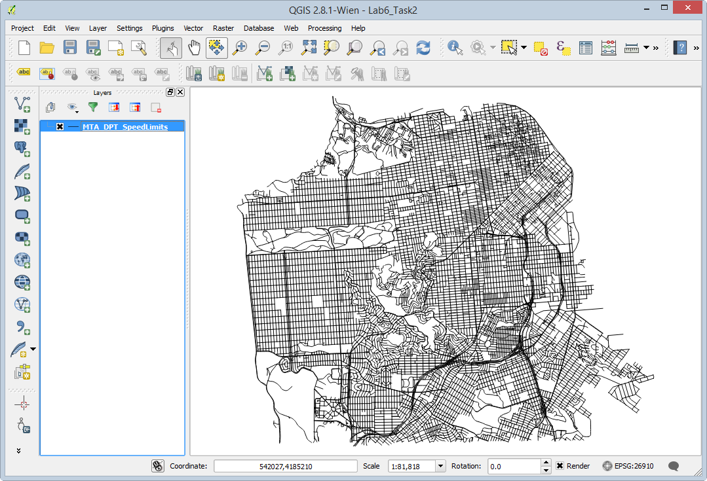

4. This is a street network for the City of San Francisco. Open the attribute table to see what kind of data you have to work with. Notice that in addition having the street name and type, there is a column populated with speed limits for each road segment. Close the attribute table.

5. Open the **Layer Properties | Style** tab and symbolize the data by speed limit. 

	a. Choose a Categorized renderer

	b. Column = speedlimit

	c. Color ramp = Greys

	d. Click Classify

	e. Click OK (see figure below)

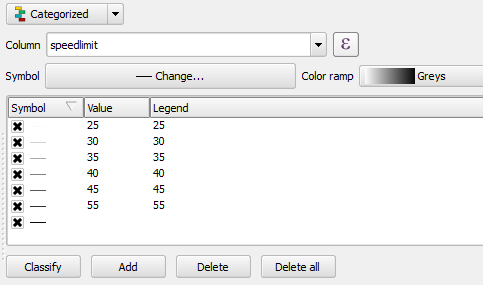

Your map should resemble the figure below. You can now distinguish the major arteries.

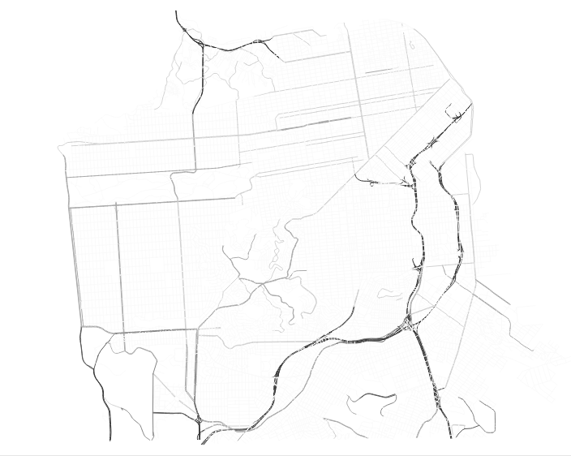

8. Save your map as `Lab 6.qgs`.

9. You will use the **QGIS Road Graph** plugin to find the shortest distance between two points on the network. From the menu bar choose **Plugins | Manage and Install Plugins**.

10. Select the **All** tab, and type `Road` into the Search bar.

11. Check the box next the `Road graph plugin` to enable it (figure below). Click **Close**. 

10. A new panel, named **Shortest** path, will appear below the Layers panel. If it does not, click **View | Panels | Shortest path**.

11. Before you begin you need to configure the Road graph plugin. From the menu bar, choose **Vector | Road Graph | Settings**. The Road Graph settings window opens. Choose the following settings (reference figure below):

	a. Time unit: hour

	b. Distance unit: kilometer

	c. Topology tolerance: 10

	d. Layer: MTA_DPT_SpeedLimits

	e. Direction field: Always use default

	f. Speed field: speedlimit km/h

	g. Click **OK** to set the settings

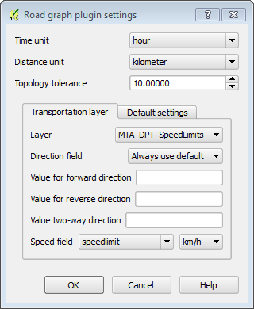

12. Now you will populate the Shortest path panel (below the Layers panel). Click the Start location   button and click on a spot anywhere on the map. Do the same for the Stop location via the Stop location button. Small dots will appear where you have clicked.

13. Set the Criterion as Length.

14. Click Calculate to find the shortest path between the two points. After some processing, a red line will appear as the solution (example shown in figure below).

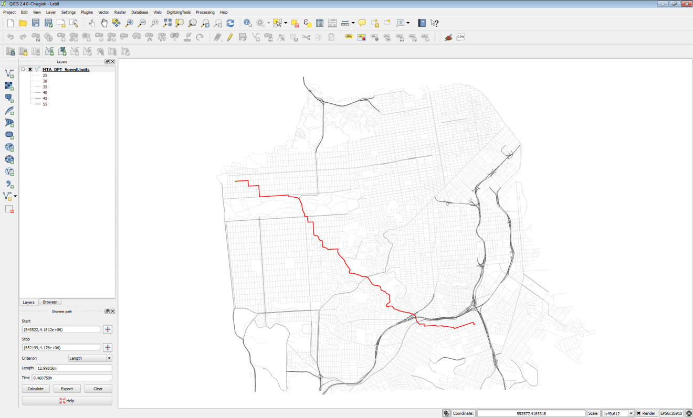

14. To save the shortest path click the Export button.

15. Choose New temporary layer as the Select destination layer. Click OK. The shortest path will now appear in your Layers panel and on the map canvas. 

15. To make this layer permanent right-click on it and choose Save As…  Save the data to a shapefile in the Lab 6 Data folder named ShortestPath.shp (see figure below),

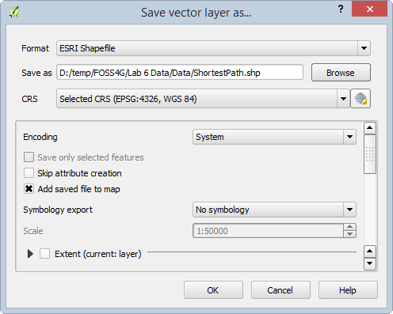

16. Remove the temporary shortest path layer from the Layers panel.
16. Now you will determine the shortest drive time between the two points. In the Shortest path panel, change the Criterion to Time.
17. Click Calculate. With this Criterion, you may get a very different solution, depending on the points you chose.
17. Click Export to save this layer to a New temporary layer, and again, save that temporary file out to a shapefile. Name this file FastestRoute.shp.
18. Remove the temporary layer from the map, leaving just the street network and two solutions.
18. Click Clear on the Shortest path button to remove the temporary red line showing the fastest route.
19. Style the ShortestPath layer as a red line with a thickness of 0.46 and the FastestRoute layer with a dark blue line of equal thickness. With the points I chose, I had two very different solutions (figure below).

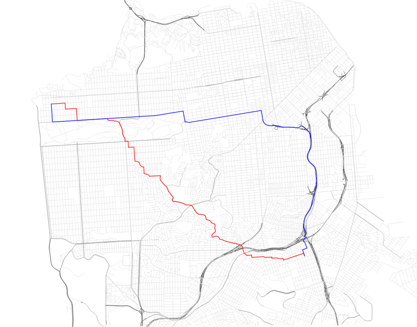

19. Save your map file and close QGIS Desktop.

### Task 2 Allocating Service Areas

Now you will use some GRASS tools to allocate portions of the road network served by each San Francisco Police Station. GRASS is a mature and powerful free and open source (FOSS) GIS software package. It has a unique data structure that can be initially intimidating. Fortunately, QGIS Desktop has a GRASS plugin that provides a much more intuitive interface to the large suite of GRASS analysis tools. 

1. Re-open QGIS Desktop or start a new project. 

2. Add these three shapefile layers: `SF_Police`, `SF_FireStations` and `SF_Streets`.

GRASS uses its own file format. These layers are stored in a GRASS Database, which is essentially a folder with containing GRASS data. We will be importing these layers into GRASS from shapefiles. In QGIS Desktop they will behave just like any other layer. However, since they are stored as GRASS Vectors, you can also use the suite of GRASS tools with them. These tools include a set for network analysis.

3. First, you will enable the GRASS plugin. From the menu bar choose **Plugins | Manage and Install plugins**.

The GRASS plugin is a core QGIS plugin. This means it is already installed and all you need to do is enable it.

4. Click on the **Installed** tab. Find **GRASS** and check the box to turn it on. Click **Close** when done. 

Enabling the GRASS plugin turns on a new toolbar. If the toolbar does not appear, click View | Toolbars | GRASS.

We will go through the steps of adding the data to GRASS. 

*The following is simply an explanation to get you oriented to the GRASS data structure and show you how the GRASS data was loaded in to QGIS Desktop. Remember GRASS data is stored in a GRASS database, which again is simply a folder. Inside the database will be folder(s) called Locations and inside a Location will be folder(s) called Mapsets.*

*GRASSdb | Locations | Mapsets*

*Locations represent a certain spatial extent and coordinate reference system that you identify when you create one. Mapsets are a way to organize data and are the data tier that actually contains data layers. Every Location contains a default Mapset named PERMANENT. Additional Mapsets can be set up for individual users (Tom, Mary, Alice etc,) or for categories of data such as hydrology, transportation, boundaries etc.*

To begin working with the GRASS tools you need to have a GRASS Mapset open.

We are going to create a new mapset, and import layers into that from the shapfiles.

- Click **Plugins > GRASS > New mapset**
- Create a new folder within your current folder, and click **Next**.
- Set **Location** to `SF`
- Set **Projection** to `26910`
- For the regions, click **Set current QGIS extent**
- Give the mapset the name `SF`

5. In the **GRASS Tools** window, open **File management > Import into GRASS > Import vector into GRASS > v.in.ogr**
- Select the `MTA_DPT_Speed Limits.shp` tom importn and send the name to `SF_Streets`. 
- Click **Run** and various text messages should appear. 
- Then click **View output** which will load the GRASS vector layer into the QGIS window. 

6. Repeat this process for the **SF_Police** and **SF_FireStations** layers. 
- Once you have all three layers imported, hide (uncheck) the Shapefile GIS layers in the Layers Panel. 

9. The first step in doing a network analysis in GRASS is the build a network dataset. In the GRASS Tools window, expand Vector | Spatial Analysis | Network analysis| v.net - Network Maintenance tool. This will open the tool in a new tab to the right of the Browser tab.

This tool will create a linear network of San Francisco streets and attach nodes representing the Police stations.Additionally, the tool itself has three tabs. Options, Output, and Manual. The Options tab is where you fill out your parameters before running the tool. When you run the tool, it will switch to the Output tab and you will see details about the running process. The Manual tab contains the documentation for the tool.

10. Enter the parameters described below and shown in the figure below:

	a. Name of input vector map: SF_Streets (SF_Streets@PERMANENT 1 line)

	b. Name of input point vector map: SF_Police ( SF_Police@PERMANENT 1 point)

	c. Operation to be performed: Connect still unconnected points to vector network by inserting new line(s)

	d. Arc layer: 1

	e. Node layer: 2

	f. Threshold: 300

	g. Name for output vector map: SF_Network

	h. Click Run

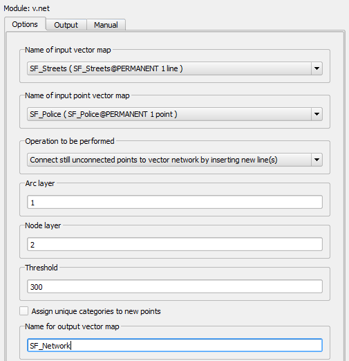

While running the Output tab will be visible (shown in figure below).

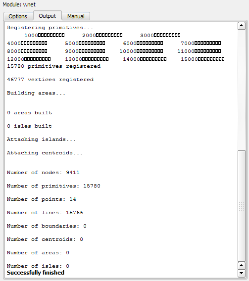

11. Click the View output button to add the network dataset to QGIS.
12. For now, leave the GRASS tools window open. You may want to move it to the side so you can see the map.
13. Turn off the SF_FireStations and SF_Police layers.

In addition to the linear network, this operation produced nodes for each police station point. The View output only added the linear network to QGIS, so you will now add the network nodes to QGIS.

14. Use the **Browser Panel (2)** for this. *Right-click and select **Broswer Panel (2)** if it is not already visible*

14. Navigate to the folder where you created the GRASS database earlier. 

14. Drag and drop two layers into the Layers Panel (SF > SF_Network> 1 & 2). (Remember when you ran the v.net tool you specified that the ID for the Arc layer was 1 and the node layer 2.)

It should look roughly like this:

16. Open the attribute table for the SF_Network_2 node layer. It has one column named cat with values for each of the 14 police stations (1-14). Close the table.

Now that the network dataset is constructed, you will identify the road territory that each police station should serve.

17. In the GRASS Tools window switch back the Modules Tree tab.
18. Click on v.net.alloc – Allocate network tool. The tool will open in yet another tab.
18. Fill out the tool form as described below and as seen in the figure below.
	
	a. Input arcs: SF_Network ( SF_Network@MyData 1 line, i.e. out street network)

	b. Input nodes: SF_Network ( SF_Network@MyData 2 point, i.e. our police stations)

	c. In Cats type out: 1,2,3,4,5,6,7,8,9,10,11,12,13,14 *Note*: these are the values for each police station from the SF_Network_2 node attribute table.

	d. Name for output vector map: PoliceSt_Allocation

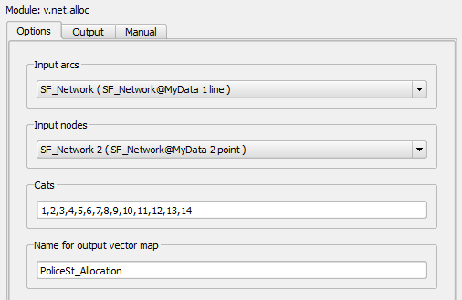

19. When the tool is set up correctly, click Run. When complete click View output.
20. Turn off the visibility of the SF_Network and SF_Streets layers.
20. Open the attribute table for the PoliceSt_Allocation layer. Notice that it simply has the cat ID of each of the 14 police stations. 

23. Close the GRASS Tools window.

24. To see the results of your analysis you will Style the PoliceSt_Allocation layer. Open the Layer Properties | Style tab. Choose the following parameters:

	a. Renderer: Categorized

	b. Column: cat

	c. Color ramp: Random colors

	d. Click Classify

	e. Click OK

25. Now turn OFF the SF_Network 2 layer and turn ON the SF_Police layer.

26. Drag the SF_Police layer above the PoliceST_Allocation layer in the Layers panel.

26. Next you will label the Police stations with their name. Open the Layer Properties | Labels tab for the SF_Police layer. 

	a. Check the Label this layer with box

	b. Choose FACILITY_N as the attribute column

	c. Click the Text tab below and  make the font size 9 and Bold

	d. Click the Buffer tab and click Draw text buffer and make the size 1.0

	e. Click OK.

27. Your map should resemble the figure below.

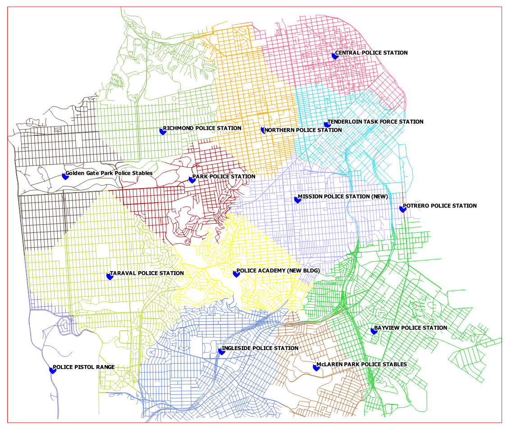

Try removing one (or more) of the police stations (by altering the ‘cats’ entry in the v.net.alloc tool). How does the allocation change?

### 3 Conclusion

In this lab, you were exposed to basic network routing and allocation analysis. You calculated the shortest distance between two points via both time and distance. You then determined which portions of the network that should be allocated to each police station. There are many applications for this type of analysis including emergency management, parcel delivery, and general navigation. 

### 4 Discussion Questions

1. What is a real world application of network analysis? Explain.
2. How can a network analysis benefit the logistics industry?
3. What other linear networks could this apply to other than roads?

### 5 Challenge Assignment (optional)

The San Francisco Police Department has shown your analysis to their colleagues at the Fire Department and they were impressed. Now the Fire Department would like the same analysis done for their stations. In the PERMANENT mapset there is a SF_FireStations GRASS vector layer. Repeat the steps in the second task to create the same allocation analysis for the Fire Department. Compose a map of the results of the Fire Department analysis.
